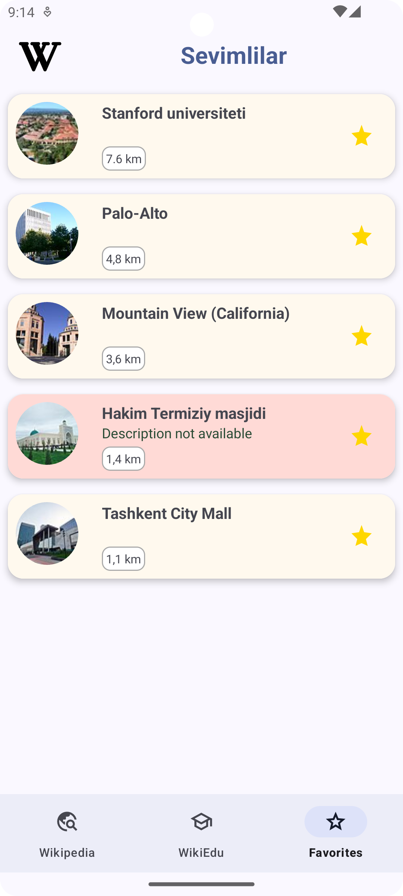

# WikiExplorer
#### Video Demo:  <URL HERE>

## Table of Contents
- [Description](#description)
- [Features](#features)
- [Technologies](#technologies)
- [Challenges](#challenges)
- [Feature Plans](#feature-plans)
- [Usage](#usage)
- [Screenshots](#screenshots)
- [Contributing](#contributing)
- [License](#license)
- [Contact](#contact)

## Description

WikiExplorer is an innovative app designed to help users discover and explore fascinating places through Wikipedia. It serves as an educational tool for tourists, simplifying the process of learning about the countries and areas they visit. The app leverages Wikipedia's vast collection of articles, which are open for anyone to edit and improve.

Similar to the Wikimedia Project: WikiVoyage, WikiExplorer utilizes MediaWiki's Nearby Places and Geosearch features to create an intuitive and user-friendly experience. The app includes an educational component called WikiTutorial, which helps new users familiarize themselves with Wiki editing. By mastering these skills, users can contribute to the WikiExplorer app by adding, editing, and enhancing articles about interesting and attractive places.

WikiExplorer is a non-profit, educational project developed as the final project for CS50x.

## Features

- Virtual travel to new locations across the globe
- WikiTutorial: Learn how to contribute to Wikipedia, from beginner to expert
- Search function to quickly locate destinations (planned)
- Offline reading and bookmarking of favorite locations
- Interactive widget displaying Wikipedia's latest contribution statistics
- Notifications for upcoming new lesson uploads
- Light and dark themes
- Multi-language support: Uzbek, Russian, and English (with plans to support at least ten languages)
- Mobile-friendly responsive design

## Technologies

WikiExplorer leverages a variety of modern Android technologies, focusing on MAD (Modern Android Development) skills, app architecture, and UI/UX design:

1. UI/UX built with Material Design 3 components, adhering to its guidelines
2. Room and SharedPreferences for data persistence (future upgrade to DataStore planned)
3. Hilt for dependency injection
4. Kotlin Coroutines for asynchronous programming
5. MVVM architecture with appropriate packaging of classes
6. Single Activity pattern with mobile navigation support
7. Picasso for efficient image loading and caching
8. Firebase Crashlytics for crash reporting and analysis
9. Retrofit, OkHttp3, and Mockito for API data parsing
10. Integration of YouTube Data API v3 and Google Maps SDK

## Challenges

The development of WikiExplorer spanned approximately three months and presented various challenges:

- UI/UX planning and implementation of a modern, user-friendly design using Material Design 3
- Optimizing app performance and addressing unforeseen bugs
- Learning and implementing Kotlin Coroutines, MVVM architecture, and Hilt Injection
- Resolving dependency issues and critical bugs related to Hilt Injection
- Tackling JSON parsing challenges with Mockito
- Improving app responsiveness using Kotlin Coroutines and Hilt Module setup
- Creating a custom AppWidget for displaying Wikipedia statistics

These challenges provided valuable learning experiences in time management, bug fixing, and problem-solving.

## Feature Plans

Future plans for WikiExplorer include:

- Migrating the UI from XML layouts to Jetpack Compose
- Implementing additional features and exploring different architectural approaches (e.g., layered architecture with UI, data, and domain layers)

## Usage

1. Launch the app
2. Browse places near Tashkent (default location) or use the "Maps" button to choose a different location
3. Save favorite places for offline reading
4. Explore WikiTutorial playlists to learn Wiki editing skills
5. Change the app language (Uzbek, English, or Russian) to fetch articles from the corresponding Wikipedia
6. Use the Translation tool to contribute to non-existing articles in Uzbek Wikipedia
7. Add the WikiExplorer widget to your home screen for quick access to Wikipedia statistics
8. Share the app and explore the world!

## Screenshots

[Add screenshots of your app here]

## Contributing

We welcome contributions to WikiExplorer! To contribute:

1. Fork the repository
2. Create a new branch (`git checkout -b feature-branch`)
3. Make your changes and commit them (`git commit -m 'Add some feature'`)
4. Push to the branch (`git push origin feature-branch`)
5. Open a pull request

Please ensure your code adheres to our coding guidelines.

## License

This project is licensed under the Apache 2.0 License - see the [LICENSE](LICENSE) file for details.

## Contact

For questions or suggestions, feel free to reach out:

- Email: zarifboyevj@icloud.com
- GitHub: [Zarifboyev](https://github.com/Zarifboyev)
- LinkedIn: [Javohir Zarifboyev](https://www.linkedin.com/in/javohir-zarifboyev/)

Made with ❤️ by [Javohir Zarifboyev](https://www.linkedin.com/in/javohir-zarifboyev/)
